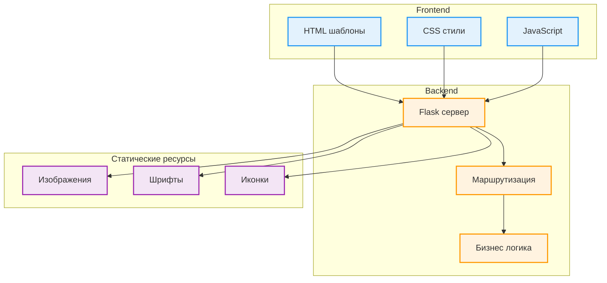

# 🏠 HomeCookingLvl2 - Веб-сайт кафе "Домашняя кухня" (улучшенная версия)

<div align="center">
  
  <p><em>Главная страница веб-сайта HomeCookingLvl2</em></p>
</div>

[](https://python.org)
[](https://flask.palletsprojects.com)
[](https://developer.mozilla.org/docs/Web/HTML)
[](https://developer.mozilla.org/docs/Web/CSS)
[](https://choosealicense.com/licenses/mit/)

## 🎯 О проекте

**HomeCookingLvl2** - это улучшенная версия веб-сайта для кафе "Домашняя кухня", разработанная с использованием Flask фреймворка. Проект представляет собой продвинутое веб-приложение с расширенным функционалом, адаптивным дизайном и улучшенной архитектурой по сравнению с оригинальной версией.

### 🌐 Доменное имя
**домашняякухня.рус** - готовый к продакшену веб-сайт

### 🆕 Что нового в Lvl2
- Улучшенная архитектура кода
- Расширенный функционал
- Оптимизированная производительность
- Улучшенный пользовательский интерфейс

## ✨ Основные возможности

🍽️ **Онлайн меню** - Интерактивное меню с описанием блюд и ценами  
📍 **Информация о кафе** - Адрес, часы работы, контактная информация  
📞 **Обратная связь** - Формы для связи с администрацией  
📱 **Адаптивный дизайн** - Оптимизация под мобильные устройства  
⚡ **Быстрая загрузка** - Оптимизированный код и ресурсы  
🎨 **Современный интерфейс** - Привлекательный дизайн в стиле кафе  

## 🖥️ Интерфейс сайта

### Меню кафе
<div align="center">
  
  <p><em>Раздел меню с категориями блюд</em></p>
</div>

### О нас
<div align="center">
  
  <p><em>Информация о кафе и команде</em></p>
</div>

### Контакты
<div align="center">
  
  <p><em>Контактная информация и форма обратной связи</em></p>
</div>

## 📁 Структура проекта

```
HomeCookingLvl2/
├── main.py                    # Основной Flask сервер
├── requirements.txt           # Зависимости проекта
├── static/                    # Статические ресурсы
│   ├── css/                   # Стили CSS
│   ├── js/                    # JavaScript файлы
│   └── images/                # Изображения сайта
├── templates/                 # HTML шаблоны
│   ├── index.html            # Главная страница
│   ├── menu.html             # Страница меню
│   ├── about.html            # О нас
│   └── contact.html          # Контакты
└── docs/                     # Документация и скриншоты
```

## 🏗️ Архитектура веб-приложения



## 🚀 Быстрый старт

### Системные требования
- Python 3.7 или выше
- Flask 2.0+
- Современный веб-браузер

### Установка и запуск

1. **Клонирование репозитория**
```bash
git clone https://github.com/mama-lama/HomeCookingLvl2.git
cd HomeCookingLvl2
```

2. **Создание виртуального окружения (рекомендуется)**
```bash
python -m venv venv
source venv/bin/activate  # На Windows: venv\Scripts\activate
```

3. **Установка зависимостей**
```bash
pip install -r requirements.txt
```

4. **Запуск сервера**
```bash
python main.py
```

5. **Открытие в браузере**
```
http://localhost:5000
```

## 🛠️ Технологический стек

### Backend
- **Flask** - веб-фреймворк Python
- **Jinja2** - шаблонизатор для HTML
- **Werkzeug** - WSGI утилиты

### Frontend
- **HTML5** (56.6%) - структура веб-страниц
- **CSS3** (8.3%) - стилизация и адаптивный дизайн
- **JavaScript** - интерактивность и динамика
- **Bootstrap** (возможно) - адаптивная сетка

### Инфраструктура
- **Git** - контроль версий
- **GitHub** - хостинг кода
- **Готовый домен** - домашняякухня.рус

## 🌟 Особенности проекта

### Веб-разработка
- **Fullstack решение** - от backend логики до frontend интерфейса
- **Адаптивный дизайн** - корректное отображение на всех устройствах
- **SEO оптимизация** - правильная структура для поисковых систем
- **Производительность** - быстрая загрузка страниц

### Пользовательский опыт
- **Интуитивная навигация** - легкий доступ ко всем разделам
- **Визуальная привлекательность** - современный дизайн кафе
- **Информативность** - полная информация о заведении
- **Контактные формы** - удобная связь с клиентами

## 📊 Статистика проекта

- **Языки**: HTML 56.6%, Python 35.1%, CSS 8.3%
- **Участники**: 👥 3 разработчика
- **Лицензия**: MIT
- **Версия**: Level 2 (улучшенная)

## 🎨 Дизайн и UX

### Цветовая схема
- Теплые тона для создания уютной атмосферы кафе
- Контрастные элементы для удобства чтения
- Профессиональная типографика

### Адаптивность
- Мобильная версия для смартфонов
- Планшетная версия для средних экранов
- Десктопная версия для больших мониторов

## 🔮 Планы развития

### Функциональные расширения
- **Онлайн бронирование** столиков
- **Система отзывов** клиентов
- **Галерея блюд** с детальными фотографиями
- **Новости и акции** кафе
- **Интеграция с соцсетями**

### Технические улучшения
- **CMS система** для управления контентом
- **База данных** для динамического контента
- **API endpoints** для мобильного приложения
- **Аналитика посещений** и поведения пользователей

## 👥 Команда разработки

- **[@mama-lama](https://github.com/mama-lama)** - Ведущий разработчик, архитектура проекта
- **[@dino-mayk](https://github.com/dino-mayk)** - Оригинальный автор, backend разработка
- **Дополнительные участники** - frontend, тестирование и оптимизация

### Роли в проекте
- **Backend разработка** - Flask сервер, маршрутизация, логика
- **Frontend разработка** - HTML/CSS верстка, JavaScript интерактивность
- **Дизайн** - UI/UX, визуальная концепция, пользовательский опыт
- **Тестирование** - проверка функционала и кроссбраузерность

## 📈 Развертывание

### Локальная разработка
```bash
export FLASK_ENV=development  # На Windows: set FLASK_ENV=development
export FLASK_DEBUG=1          # На Windows: set FLASK_DEBUG=1
flask run
```

### Продакшн развертывание
- **Готов для продакшена** с доменом домашняякухня.рус
- **Совместим с хостингами** поддерживающими Python/Flask
- **Конфигурация сервера** включена в проект

## 📄 Лицензия

Проект распространяется под лицензией **MIT**. Подробности в файле [LICENSE](LICENSE).

## 🤝 Вклад в проект

Мы приветствуем вклад в развитие проекта! Если вы хотите участвовать:

1. **Fork** репозитория
2. Создайте **feature branch** (`git checkout -b feature/AmazingFeature`)
3. **Commit** изменения (`git commit -m 'Add some AmazingFeature'`)
4. **Push** в branch (`git push origin feature/AmazingFeature`)
5. Откройте **Pull Request**

### 📋 Как помочь
- Сообщения об ошибках
- Предложения новых функций
- Улучшения дизайна
- Оптимизация кода
- Тестирование на разных устройствах

## 📞 Контакты

**Ведущий разработчик**: [@mama-lama](https://github.com/mama-lama)  
**Оригинальный автор**: [@dino-mayk](https://github.com/dino-mayk)

**Ссылка на проект**: [https://github.com/mama-lama/HomeCookingLvl2](https://github.com/mama-lama/HomeCookingLvl2)  
**Веб-сайт**: домашняякухня.рус

---

<div align="center">
  <p><strong>HomeCookingLvl2 - вкус домашней кухни в цифровом мире! 🏠🍳✨</strong></p>
  <p><em>Улучшенная версия с расширенным функционалом и лучшей архитектурой</em></p>
</div>